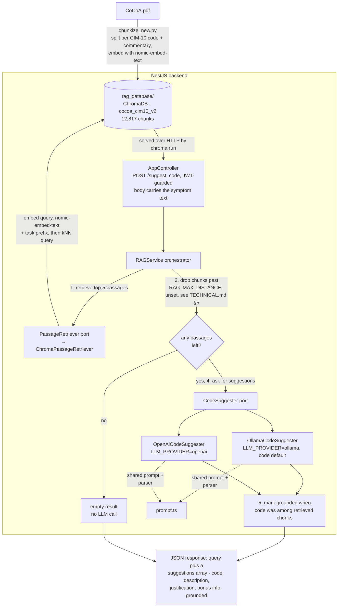
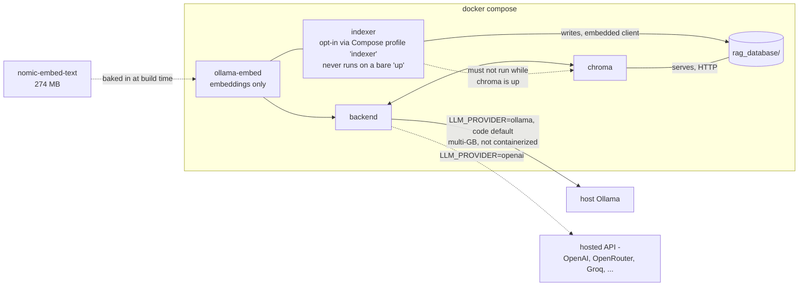

# Architecture diagrams (Mermaid)

Mermaid versions of the two diagrams in [`TECHNICAL.md`](TECHNICAL.md#3-architecture)
§3, kept in their own file so they render on viewers that support Mermaid
(GitHub, most Markdown editors) without depending on it — `TECHNICAL.md` keeps
the plain-ASCII versions as the primary reference.

## Request pipeline

## Deployment topology (Docker)

